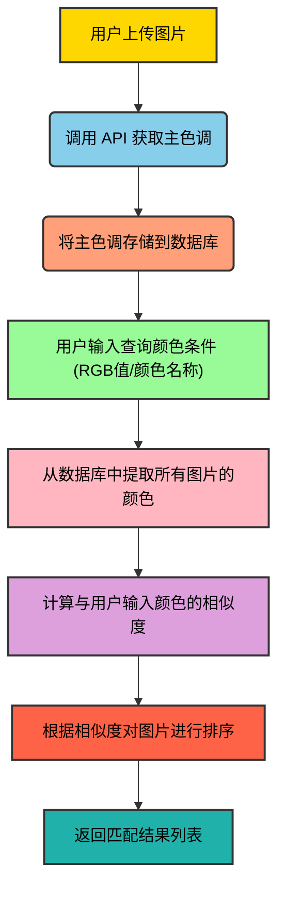

为了提升性能，避免每次搜索都实时计算图片主色调，建议在图片上传成功后立即提取主色调并存储到数据库的独立字段中。

### 1、完整流程差不多是这个样子的：

1. 提取图片颜色：通过图像处理技术（云服务 API 或者 OpenCV 图像处理库）提取图片的颜色特征，可以采用主色调、颜色直方图等方法表示图片的颜色特征。
2. 存储颜色特征：将提取的颜色数据存储到数据库中，以便后续快速检索。
3. 用户查询输入：用户通过颜色选择器、RGB 值输入、或预定义颜色名称指定颜色查询条件。
4. 计算相似度：根据用户指定的颜色，与数据库中的颜色特征进行相似度计算（如欧氏距离、余弦相似度等方法）。
5. 返回结果：由于空间内的图片数量相对较少，可以按照图片与目标颜色的相似度进行排序，优先返回最符合用户要求的图片，而不是仅返回完全符合指定色调的图片。



### 2、怎么获取图片主色调？

存储图片使用的 COS 对象存储服务已经整合了数据万象，自带获取图片主色调的功能，[参考文档](https://cloud.tencent.com/document/product/460/6928)。

可以详细了解下服务的相关限制，比如 [数据万象的限制](https://cloud.tencent.com/document/product/460/36620)，不过一般情况下达不到限制。

除了方便之外，这个功能属于基础图片处理，官方提供的免费额度较高，差不多10TB，完全用不完：


### 3、如何计算颜色相似度？

数据库不支持直接按照颜色检索，用 like 检索又不符合颜色的特性。所以可以使用一些算法来解决。

此处使用 **欧几里得距离** 算法：颜色可以用 RGB 值表示，可以通过计算两种颜色 RGB 值之间的欧几里得距离来判断它们的相似度。

```latex
\[d = \sqrt{(R2 - R1)^2 + (G2 - G1)^2 + (B2 - B1)^2}\]
```

解释：

- R1, G1, B1：第一个颜色的 RGB 分量（红色、绿色、蓝色）。
- R2, G2, B2：第二个颜色的 RGB 分量。
- d：两个颜色之间的欧几里得距离。

还有一些其他的方法，网上查的：

- 余弦相似度 (Cosine Similarity)
- 曼哈顿距离 (Manhattan Distance)
- Jaccard 相似度 (Jaccard Similarity)
- 平均颜色差异 (Mean Color Difference)
- 哈希算法 (Color Hashing)
- 色调、饱和度和亮度 (HSL) 差异

### 4、后端开发

修改 PictureUploadTemplate 的 buildResult 方法，直接从 ImageInfo 对象中就能获得主色调：

```java
uploadPictureResult.setPicColor(imageInfo.getAve());
```

#### 颜色相似度计算

直接利用 AI 来编写工具类：

```java
/**
 * 工具类：计算颜色相似度
 */
public class ColorSimilarUtils {

    private ColorSimilarUtils() {
        // 工具类不需要实例化
    }

    /**
     * 计算两个颜色的相似度
     *
     * @param color1 第一个颜色
     * @param color2 第二个颜色
     * @return 相似度（0到1之间，1为完全相同）
     */
    public static double calculateSimilarity(Color color1, Color color2) {
        int r1 = color1.getRed();
        int g1 = color1.getGreen();
        int b1 = color1.getBlue();

        int r2 = color2.getRed();
        int g2 = color2.getGreen();
        int b2 = color2.getBlue();

        // 计算欧氏距离
        double distance = Math.sqrt(Math.pow(r1 - r2, 2) + Math.pow(g1 - g2, 2) + Math.pow(b1 - b2, 2));

        // 计算相似度
        return 1 - distance / Math.sqrt(3 * Math.pow(255, 2));
    }

    /**
     * 根据十六进制颜色代码计算相似度
     *
     * @param hexColor1 第一个颜色的十六进制代码（如 0xFF0000）
     * @param hexColor2 第二个颜色的十六进制代码（如 0xFE0101）
     * @return 相似度（0到1之间，1为完全相同）
     */
    public static double calculateSimilarity(String hexColor1, String hexColor2) {
        Color color1 = Color.decode(hexColor1);
        Color color2 = Color.decode(hexColor2);
        return calculateSimilarity(color1, color2);
    }

    // 示例代码
    public static void main(String[] args) {
        // 测试颜色
        Color color1 = Color.decode("0xFF0000");
        Color color2 = Color.decode("0xFE0101");
        double similarity = calculateSimilarity(color1, color2);

        System.out.println("颜色相似度为：" + similarity);

        // 测试十六进制方法
        double hexSimilarity = calculateSimilarity("0xFF0000", "0xFE0101");
        System.out.println("十六进制颜色相似度为：" + hexSimilarity);
    }
}
```

`searchPictureByColor`：

```java
//  查询该空间下所有图片（必须有主色调）
List<Picture> pictureList = this.lambdaQuery()
    .eq(Picture::getSpaceId, spaceId)
    .isNotNull(Picture::getPicColor)
    .list();
// 如果没有图片，直接返回空列表
if (CollUtil.isEmpty(pictureList)) {
    return Collections.emptyList();
}
// 将目标颜色转为 Color 对象
Color targetColor = Color.decode(picColor);
//  计算相似度并排序
List<Picture> sortedPictures = pictureList.stream()
    .sorted(Comparator.comparingDouble(picture -> {
        // 提取图片主色调
        String hexColor = picture.getPicColor();
        // 没有主色调的图片放到最后
        if (StrUtil.isBlank(hexColor)) {
            return Double.MAX_VALUE;
        }
        Color pictureColor = Color.decode(hexColor);
        // 越大越相似
        return -ColorSimilarUtils.calculateSimilarity(targetColor, pictureColor);
    }))
    // 取前 12 个
    .limit(12)
    .collect(Collectors.toList());
// 返回结果
return sortedPictureList.stream()
    .map(PictureVO::objToVo)
    .collect(Collectors.toList());
```

### 5、接口开发

1）请求封装类 SearchPictureByColorRequest，需要传入空间 id 和主色调：

```java
@Data
public class SearchPictureByColorRequest implements Serializable {

    /**
     * 图片主色调
     */
    private String picColor;

    /**
     * 空间 id
     */
    private Long spaceId;

    private static final long serialVersionUID = 1L;
}
```

2）开发接口：

```java
@PostMapping("/search/color")
public BaseResponse<List<PictureVO>> searchPictureByColor(@RequestBody SearchPictureByColorRequest searchPictureByColorRequest, HttpServletRequest request) {
    ThrowUtils.throwIf(searchPictureByColorRequest == null, ErrorCode.PARAMS_ERROR);
    String picColor = searchPictureByColorRequest.getPicColor();
    Long spaceId = searchPictureByColorRequest.getSpaceId();
    User loginUser = userService.getLoginUser(request);
    List<PictureVO> result = pictureService.searchPictureByColor(spaceId, picColor, loginUser);
    return ResultUtils.success(result);
}
```