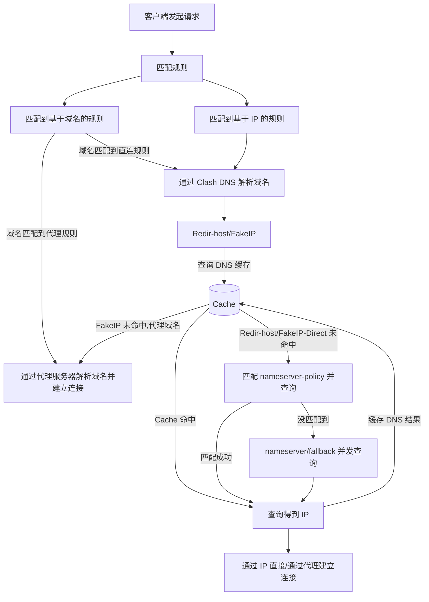

## 基本配置项：

我们在电脑上运行`Clash for Windows`时，其实是调用了`Clash`的内核，并且加载了`yaml`配置文件。配置文件可能是机场提供的订阅地址，或者是你通过订阅转换获取的。

总之，配置文件的内容大概长这样：

- 监听端口7890
- 配置了两个节点
- 以及两个节点组。

第一个节点组包含两个节点，默认选中了香港节点；第二个节点组包含两个节点，默认选择了美国节点。下面是一些分流规则。此时浏览器访问`www.google.com`，由于设置了系统代理，访问谷歌的请求会被浏览器转发到系统代理监听的端口7890。

`Clash`从7890端口收到数据后，会解析数据报的内容，知道浏览器想要访问谷歌。`Clash`有全局、规则、直连、脚本四种分流模式，大家一般用的都是规则模式。于是进入规则匹配，从上到下一条条匹配规则

```yaml
port: 7890
proxies:
  - name: 香港节点
    type: ss
  - name: 美国节点
    type: ss

proxy-groups:
  - name: 节点组1
    type: select
    proxies:
      - 香港节点
      - 美国节点
  - name: 节点组2
    type: select
    proxies:
      - 美国节点
      - 香港节点

rules:
  - DOMAIN,google.com,节点组1
  - DOMAIN-SUFFIX,youtube.com,节点组1
  - DOMAIN-KEYWORD,youtube,节点组1
  - DOMAIN,ad.com,REJECT
  - SRC-IP-CIDR,192.168.1.201/32,DIRECT
  - IP-CIDR,127.0.0.0/8,DIRECT,no-resolve
  - IP-CIDR6,2620::7/32,节点组1,no-resolve
  - GEOIP,CN,DIRECT
  - DST-PORT,80,DIRECT
  - SRC-PORT,7777,DIRECT
  - PROCESS-NAME,curl,节点组2
  - MATCH,节点组1
```

`GEOIP`是一个数据库，里面包含了常见的`IP`归属地分类，如果是国内的`IP`，就走直连。

由于后面没有加`no-resolve`，所以需要将谷歌的域名解析为`IP`进行匹配。

由于`Clash`没有配置`DNS`模块，所以会交给电脑配置的本地`DNS`服务器进行解析。`Clash`会构建一条查询谷歌域名的`DNS`请求，发送给电脑配置的本地`DNS`服务器，也就是路由器。由于`DNS`请求是明文的，此时就产生了`DNS`泄露。

但是请求被墙的域名，大概率你会收到一条被污染的`DNS`响应。假设谷歌的真实`IP`是`4.4.4.4`，但是你收到的谷歌`IP`却是`5.5.5.5`，这就是`DNS`污染。

`Clash`拿到这个被污染的`DNS`响应，以为谷歌的`IP`就是`5.5.5.5`，于是会用这个`IP`和`GEOIP`的规则进行匹配，发现这个`IP`的归属地不是国内，所以这条规则也是不匹配的。

最后 `Clash`还有一个兜底，叫做`MATCH`，所有没有匹配的规则全都交给`MATCH`处理，也就是节点组1，所以这条访问谷歌的请求交给了节点组1的香港节点，将会使用香港`SS`节点的配置信息，对数据进行加密。

:::tip

刚才DNS获取到的IP只是用来IP规则的分流匹配，你发给香港节点只是域名。

所以节点收到数据后，会在它的网络环境中再次进行`DNS`解析，获取了正确的谷歌`IP`。

这时我访问百度肯定因为`GEOIP,CN,DIRECT`走直连，但我为了防止DNS泄露，在CN后加上了`no-resolve`（以前不是国内的就泄露），单独加上国内的百度域名走直连。

但是国内的小众网站并不在规则里，还是会存在走代理的情况。

平时主要访问国外网站的话比较适合。

:::

还有一种是黑名单规则


在IP规则前，先把国外网站都加上，这样就可以优先匹配到域名规则，直接交给节点处理，不会再往下匹配。

也就不会触发IP规则的DNS请求了。

需要注意的是有些机场的Clash订阅，会把`no-resolve`的IP规则放在前面，导致优先发起了`DNS`请求，造成`DNS`泄露。


下面是雷霆的DNS配置：

```yaml
dns:
  enable: true
  ipv6: false
  default-nameserver:
  - 223.5.5.5
  - 119.29.29.29
  fake-ip-range: 198.18.0.1/16
  use-hosts: true
  nameserver:
  - https://doh.pub/dns-query
  - https://dns.alidns.com/dns-query
  fallback:
  - https://doh.dns.sb/dns-query
  - https://dns.cloudflare.com/dns-query
  - https://dns.twnic.tw/dns-query
  - tls://8.8.4.4:853
  fallback-filter:
    geoip: true
    ipcidr:
    - 240.0.0.0/4
    - 0.0.0.0/32
  use-system-hosts: false
  enhanced-mode: redir-host
```

下面是魔戒的DNS配置：

```yaml
dns:
  enable: true
  listen: 127.0.0.1:1053
  ipv6: true
  default-nameserver:
  - 114.114.114.114
  - 223.5.5.5
  - 119.29.29.29
  enhanced-mode: fake-ip
  fake-ip-range: 28.0.0.1/8
  use-hosts: true
  fake-ip-filter:  
  - '*.lan'
  - '*.localdomain'
  - '*.example'
  - '*.invalid'
  - '*.localhost'
  - '*.test'
  - '*.local'
  - '*.home.arpa'
  - time.*.com
  - time.*.gov
  - time.*.edu.cn
  - time.*.apple.com
  - time1.*.com
  - time2.*.com
  - time3.*.com
  - time4.*.com
  - time5.*.com
  - time6.*.com
  - time7.*.com
  - ntp.*.com
  - ntp1.*.com
  - ntp2.*.com
  - ntp3.*.com
  - ntp4.*.com
  - ntp5.*.com
  - ntp6.*.com
  - ntp7.*.com
  - '*.time.edu.cn'
  - '*.ntp.org.cn'
  - +.pool.ntp.org
  - time1.cloud.tencent.com
  - music.163.com
  - '*.music.163.com'
  - '*.126.net'
  - musicapi.taihe.com
  - music.taihe.com
  - songsearch.kugou.com
  - trackercdn.kugou.com
  - '*.kuwo.cn'
  - api-jooxtt.sanook.com
  - api.joox.com
  - joox.com
  - y.qq.com
  - '*.y.qq.com'
  - streamoc.music.tc.qq.com
  - mobileoc.music.tc.qq.com
  - isure.stream.qqmusic.qq.com
  - dl.stream.qqmusic.qq.com
  - aqqmusic.tc.qq.com
  - amobile.music.tc.qq.com
  - '*.xiami.com'
  - '*.music.migu.cn'
  - music.migu.cn
  - +.msftconnecttest.com
  - +.msftncsi.com
  - msftconnecttest.com
  - msftncsi.com
  - localhost.ptlogin2.qq.com
  - localhost.sec.qq.com
  - +.srv.nintendo.net
  - +.stun.playstation.net
  - xbox.*.microsoft.com
  - xnotify.xboxlive.com
  - +.ipv6.microsoft.com
  - +.battlenet.com.cn
  - +.wotgame.cn
  - +.wggames.cn
  - +.wowsgame.cn
  - +.wargaming.net
  - proxy.golang.org
  - stun.*.*
  - stun.*.*.*
  - +.stun.*.*
  - +.stun.*.*.*
  - +.stun.*.*.*.*
  - heartbeat.belkin.com
  - '*.linksys.com'
  - '*.linksyssmartwifi.com'
  - '*.router.asus.com'
  - mesu.apple.com
  - swscan.apple.com
  - swquery.apple.com
  - swdownload.apple.com
  - swcdn.apple.com
  - swdist.apple.com
  - lens.l.google.com
  - stun.l.google.com
  - '*.square-enix.com'
  - '*.finalfantasyxiv.com'
  - '*.ffxiv.com'
  - '*.ff14.sdo.com'
  - ff.dorado.sdo.com
  - '*.mcdn.bilivideo.cn'
  - +.media.dssott.com
  - +.pvp.net
  nameserver:
  - tls://223.5.5.5:853
  - tls://223.6.6.6:853
  - https://doh.pub/dns-query
  - https://dns.alidns.com/dns-query
  use-system-hosts: false
```

## DNS解析流程

以下是两种常见的 DNS 配置：

```yaml
dns:
  ...
  ipv6: true
  enhanced-mode: redir-host / fake-ip
  fake-ip-range: 28.0.0.1/8
  fake-ip-filter:
    - '*'
    - '+.lan'
  nameserver:
    - https://doh.pub/dns-query
  fallback:
    - https://8.8.8.8/dns-query
  nameserver-policy:
    "geosite:cn,private":
      - https://doh.pub/dns-query
      - https://dns.alidns.com/dns-query
```

此流程图为了更直观和简单地说明 Clash.Meta 的 DNS 工作流程，忽略了 Clash 内部的 DNS 映射处理。



